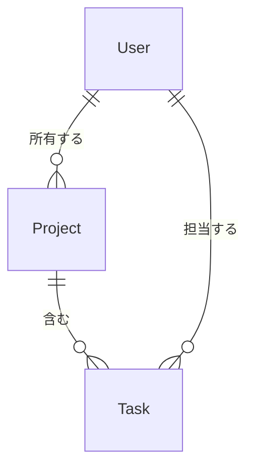

# 基本設計書作成ガイド

基本設計書作成時の詳細なポイントとセクション別の記述ガイドです。

## 基本原則

### 1. 技術選定には理由を明記

**悪い例**:

```
- React
- PostgreSQL
```

**良い例**:

```
- React 19.x
  - コンポーネントベースのUI構築により、再利用性と保守性が向上
  - 豊富なエコシステムとコミュニティサポート
  - Server Componentsによるパフォーマンス最適化が可能

- PostgreSQL 17.x
  - ACID準拠のトランザクション管理で、データ整合性を担保
  - JSONBカラムにより、柔軟なスキーマ設計が可能
  - 大規模データでのクエリ性能が実績として証明されている
```

### 2. アーキテクチャパターンの選定

プロジェクトの特性に応じて適切なパターンを選択し、選定理由を明記します。

**代表的なパターン**:

- **レイヤード**: シンプルなCRUDアプリケーション向け
- **クリーンアーキテクチャ**: ビジネスロジックが複雑な場合
- **MVC**: Webアプリケーションの標準的な構成
- **マイクロサービス**: 大規模で独立したデプロイが必要な場合

**選定理由の書き方**:

    ### アーキテクチャパターン

    クリーンアーキテクチャを採用する。

    選定理由:
    - ビジネスロジックが複雑で、フレームワークやDBに依存しない設計が必要
    - テスタビリティの確保（ユースケース層を独立してテスト可能）
    - 将来的なUI/DB変更に耐えられる柔軟性

### 3. レイヤー/コンポーネント間の依存は一方向に保つ

各レイヤーの責務を明確にし、依存関係を一方向に保ちます:

```
UI → Service → Data (OK)
UI ← Service (NG)
UI → Data (NG)
```

## 主要セクション詳細

### 1. テクノロジースタック

すべての技術選定に以下を含めます:

- バージョン（メジャーバージョン以上）
- 選定理由（なぜその技術か、代替案と比較して何が優れるか）

### 2. システムアーキテクチャ

#### Mermaid図の活用

システム全体像を図で示し、テキストで補足します。

**例**:

    ### アーキテクチャパターン

    レイヤードアーキテクチャを採用する。

    ```mermaid
    graph TB
        UI[UIレイヤー] --> Service[サービスレイヤー]
        Service --> Data[データレイヤー]
        Data --> DB[(データベース)]
    ```

#### レイヤー定義の書き方

各レイヤー/コンポーネントについて、責務・許可・禁止を明確にします。

**例**:

    #### サービスレイヤー

    - **責務**: ビジネスロジックの実装、トランザクション管理
    - **許可される操作**: データレイヤーの呼び出し、ドメインモデルの操作
    - **禁止される操作**: UIレイヤーへの依存、直接的なDB操作

### 3. データ設計

データモデルをER図で定義し、ストレージ方式を表で整理します。

**ER図の例**:



**ストレージ方式の選定ポイント**:

- データの構造化度合い（RDB vs NoSQL）
- 読み書きの比率
- スケーラビリティ要件
- チームの習熟度

### 4. インターフェース設計

レイヤー間・外部システムとのインターフェースを定義します。

**書くべき内容**:

- 外部API: エンドポイント、メソッド、概要
- 内部インターフェース: 主要なサービスの型定義

### 5. セキュリティ設計

**3つの原則**:

1. **最小権限の原則**: 必要最小限のアクセス権のみ付与
2. **入力検証**: 外部からの入力は全て検証する
3. **機密情報の管理**: ハードコードせず環境変数や秘密管理サービスを使用

### 6. パフォーマンス設計

要件定義書のパフォーマンス要件に対して、達成するための具体的な手段を記述します。

**悪い例**（要件の再記述）:

```
- API応答時間: 200ms以内
```

**良い例**（達成手段の記述）:

```
- API応答時間200ms以内を達成するために:
  - データベースクエリにインデックスを適用
  - 頻繁にアクセスされるデータにキャッシュ層を導入
  - N+1問題を防ぐためeager loadingを採用
```

## チェックリスト

- [ ] すべての技術選定に理由が記載されている
- [ ] アーキテクチャパターンの選定理由が明確である
- [ ] レイヤー/コンポーネント間の依存関係が定義されている
- [ ] データモデルが図で表現されている
- [ ] セキュリティ考慮事項が記載されている
- [ ] パフォーマンス要件の達成手段が記載されている
- [ ] バックアップ戦略が定義されている（該当する場合）
