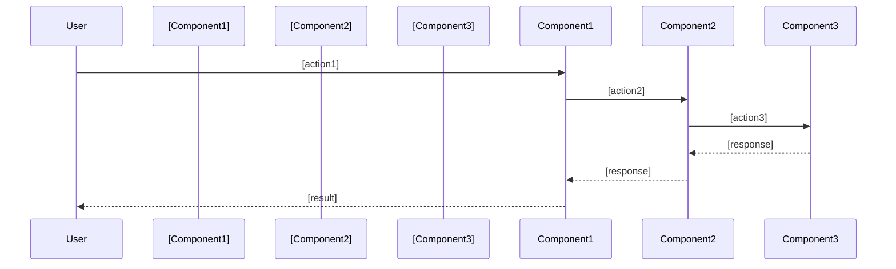
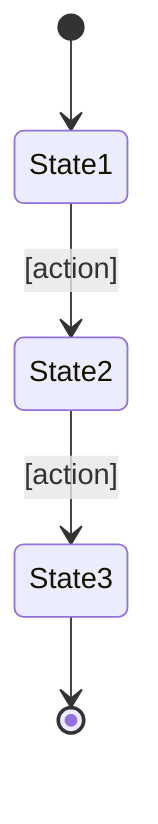

# 詳細設計書

## データモデル定義

### エンティティ: [エンティティ名]

```typescript
interface [EntityName] {
  id: string;              // UUID
  [field1]: [type];        // [説明]
  [field2]: [type];        // [説明]
  createdAt: Date;         // 作成日時
  updatedAt: Date;         // 更新日時
}
```

**制約**:

- [制約1]
- [制約2]

### ER図

```mermaid
erDiagram
    ENTITY1 ||--o{ ENTITY2 : [関係]
    ENTITY1 {
        string id PK
        string field1
        datetime createdAt
    }
    ENTITY2 {
        string id PK
        string entity1Id FK
        string field1
    }
```

## コンポーネント設計

### [コンポーネント1]

**責務**:

- [責務1]
- [責務2]

**インターフェース**:

```typescript
class [ComponentName] {
  [method1]([params]): [return];
  [method2]([params]): [return];
}
```

**依存関係**:

- [依存先1]
- [依存先2]

## ユースケース詳細

### [ユースケース1]



**フロー説明**:

1. [ステップ1]
2. [ステップ2]
3. [ステップ3]

## API設計（該当する場合）

### [エンドポイント1]

```
POST /api/[resource]
```

**リクエスト**:

```json
{
  "[field]": "[value]"
}
```

**レスポンス**:

```json
{
  "id": "uuid",
  "[field]": "[value]"
}
```

**エラーレスポンス**:

- 400 Bad Request: [条件]
- 404 Not Found: [条件]
- 500 Internal Server Error: [条件]

## 画面設計（該当する場合）

### [画面名]

**表示項目**:

| 項目     | 説明   | フォーマット   |
| -------- | ------ | -------------- |
| [項目1]  | [説明] | [フォーマット] |
| [項目2]  | [説明] | [フォーマット] |

### 画面遷移図（該当する場合）



## アルゴリズム設計（該当する場合）

### [アルゴリズム名]

**目的**: [説明]

**計算ロジック**:

1. [ステップ1]: [説明]
2. [ステップ2]: [説明]
3. [ステップ3]: [説明]

**実装例**:

```typescript
function [algorithmName]([params]): [return] {
  // [処理の説明]
}
```

## エラーハンドリング

### エラーの分類

| エラー種別 | 処理       | ユーザーへの表示 |
| ---------- | ---------- | ---------------- |
| [種別1]    | [処理内容] | [メッセージ]     |
| [種別2]    | [処理内容] | [メッセージ]     |
