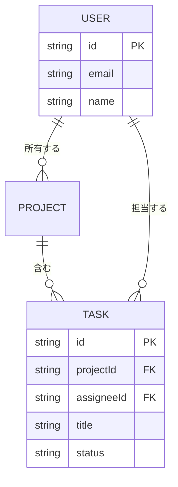
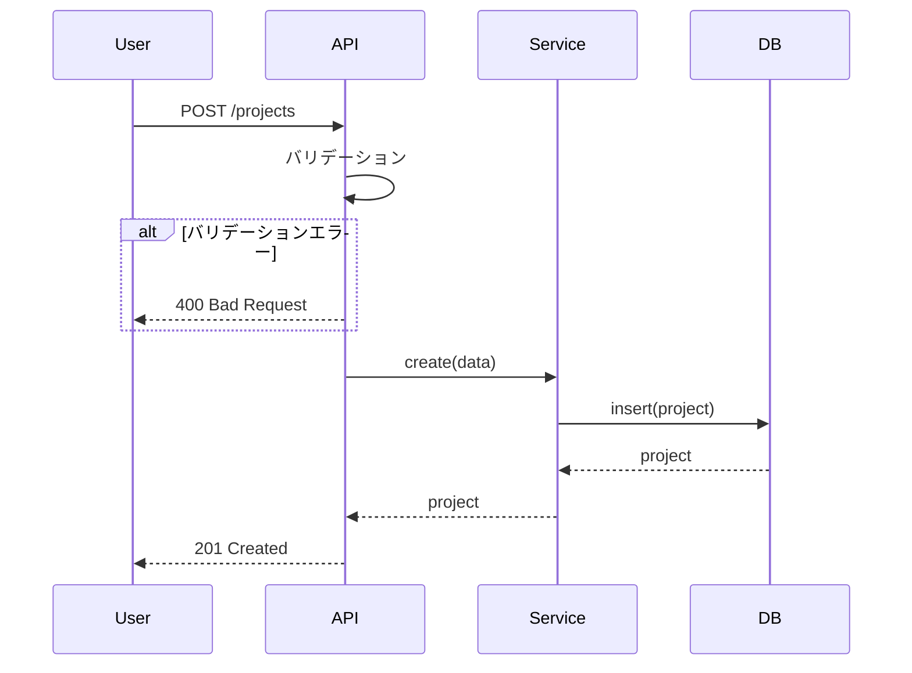

# 詳細設計書作成ガイド

詳細設計書作成時の詳細なポイントとセクション別の記述ガイドです。

## 詳細設計書の目的

詳細設計書は、基本設計書で定義された「システム構造」を「実装可能なレベル」に落とし込むドキュメントです。

**基本設計書との違い**:

- 基本設計書: 技術選定、アーキテクチャ、データストレージ方式（**何を使うか**）
- 詳細設計書: データモデル、コンポーネント、API、処理フロー（**どう実装するか**）

## 基本原則

### 1. 実装可能な詳細度

開発者がコードを書き始められるレベルまで詳細化します。

**悪い例**:

```
ユーザー管理機能を実装する
```

**良い例**:

```typescript
interface UserService {
  create(data: CreateUserInput): Promise<User>;
  findById(id: string): Promise<User | null>;
  update(id: string, data: UpdateUserInput): Promise<User>;
  deactivate(id: string): Promise<void>;
}
```

### 2. 基本設計書との整合性

基本設計書で定義されたアーキテクチャパターンとレイヤー構造に従って設計します。
基本設計書と矛盾する設計をしないでください。

### 3. Mermaid図の活用

データモデル、処理フロー、状態遷移は図で表現します。

## 主要セクション詳細

### 1. データモデル定義

#### TypeScript型定義で明確に

データモデルはTypeScriptのインターフェースで定義します。

**記述ポイント**:

- 各フィールドにコメントで説明を追加
- 制約（文字数、形式など）を明記
- オプションフィールドには`?`を付ける
- 型エイリアスで可読性を向上

**例**:

```typescript
interface User {
  id: string;           // UUID v4
  email: string;        // RFC 5322準拠、最大254文字
  name: string;         // 1-100文字
  role: UserRole;       // ユーザーの権限
  isActive: boolean;    // アカウント有効/無効
  createdAt: Date;
  updatedAt: Date;
}

type UserRole = 'admin' | 'member' | 'viewer';
```

#### ER図

複数のエンティティがある場合、関連をER図で示します。



### 2. コンポーネント設計

基本設計書のレイヤー構造に基づき、各コンポーネントのインターフェースを定義します。

**記述ポイント**:

- 責務を明確にする（何をして、何をしないか）
- メソッドのシグネチャ（引数と戻り値の型）
- 依存関係

**例**:

```typescript
// サービス層
class ProjectService {
  constructor(
    private projectRepo: ProjectRepository,
    private notifier: NotificationService
  ) {}

  async create(data: CreateProjectInput): Promise<Project>;
  async addMember(projectId: string, userId: string): Promise<void>;
  async archive(projectId: string): Promise<void>;
}
```

### 3. ユースケース詳細

主要なユースケースをシーケンス図で表現します。

**記述ポイント**:

- ユーザーアクションから始めて、レスポンスまでの全フローを記述
- エラーケースも含める（alt/optブロック）

**例**:



### 4. API設計（該当する場合）

**記述ポイント**:

- HTTPメソッドとパスを明記
- リクエスト/レスポンスのJSON構造
- エラーレスポンスの条件とステータスコード
- 認証/認可の要件

### 5. 画面設計（該当する場合）

**記述ポイント**:

- 表示項目と各項目のフォーマット
- 画面遷移図（stateDiagram）
- ユーザーインタラクション（操作フロー）

### 6. アルゴリズム設計（該当する場合）

複雑なビジネスロジックは、ステップ分解して記述します。

**記述ポイント**:

- 目的を明記
- 処理ステップを分解
- 計算式がある場合は明記
- 実装例のコードを添える

**悪い例**（曖昧）:

```
スコアを計算して優先度を決定する
```

**良い例**（具体的）:

```
1. 期限までの残日数からスコアを算出（0-100点）
2. 作成からの経過日数からスコアを算出（0-100点）
3. 加重平均で総合スコアを計算（期限:60%、経過:40%）
4. 閾値で分類: 70点以上=高、40-69点=中、39点以下=低
```

### 7. エラーハンドリング

**記述ポイント**:

- エラーの種別と発生条件
- 処理方法（中断/リトライ/フォールバック）
- ユーザーへの表示メッセージ

## チェックリスト

- [ ] データモデルが型定義で明確に記述されている
- [ ] ER図でエンティティ間の関連が示されている
- [ ] 各コンポーネントの責務とインターフェースが定義されている
- [ ] 主要ユースケースのシーケンス図がある
- [ ] エラーケースが網羅されている
- [ ] 基本設計書のアーキテクチャと矛盾がない
