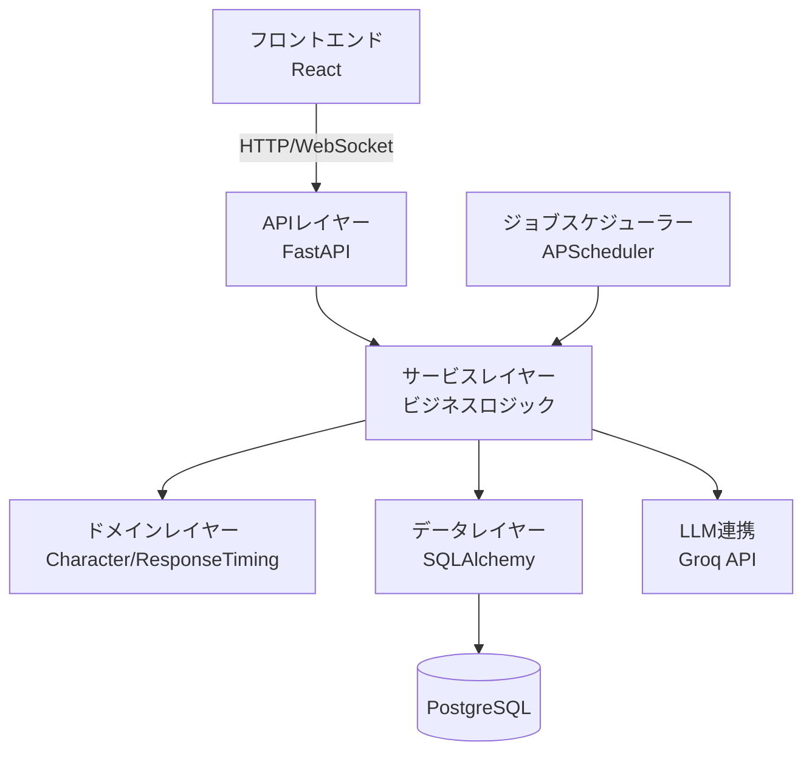
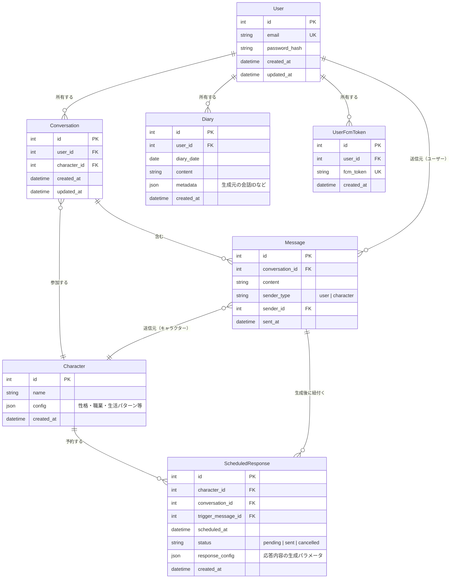

# 基本設計書

## テクノロジースタック

### 言語・ランタイム

| 技術       | バージョン | 選定理由                                                                                                                              |
| ---------- | ---------- | ------------------------------------------------------------------------------------------------------------------------------------- |
| Python     | 3.12       | async/await対応で非同期処理が得意。Groq SDKが充実。豊富なエコシステムでプロトタイプ開発が迅速。型ヒント（Type Hints）で型安全性を確保 |
| TypeScript | 5.x        | フロントエンド用。型安全性により開発時のバグを削減。IDEのサポートが充実しており、保守性が高い                                         |
| Node.js    | 22.x LTS   | フロントエンドビルド環境として使用                                                                                                    |

### フレームワーク・ライブラリ（バックエンド）

| 技術                      | バージョン | 用途                   | 選定理由                                                                                                                  |
| ------------------------- | ---------- | ---------------------- | ------------------------------------------------------------------------------------------------------------------------- |
| FastAPI                   | 0.115+     | Webフレームワーク      | 非同期処理のネイティブサポート。Pydantic v2統合で強力なバリデーション。自動OpenAPIドキュメント生成。WebSocket標準サポート |
| SQLAlchemy                | 2.0        | ORM（async対応）       | Python最大のORM。async/awaitサポート。型安全なクエリビルダー。PostgreSQLとの親和性が高い                                  |
| Alembic                   | 1.13+      | マイグレーション       | SQLAlchemyの公式マイグレーションツール。バージョン管理が容易                                                              |
| APScheduler               | 3.10+      | ジョブスケジューリング | FastAPIと統合しやすい。非同期ジョブサポート。返信タイミング制御と日記生成の定期実行に使用                                 |
| groq                      | latest     | LLM API連携            | Llama 3.3 70Bを利用した自然な会話生成と日記要約を実現。OpenAI比で約1/6のコスト。Pythonライブラリが最も成熟                |
| passlib[bcrypt]           | 1.7+       | パスワードハッシュ化   | セキュアなパスワード保存のための業界標準ライブラリ。bcryptアルゴリズム対応                                                |
| python-jose[cryptography] | 3.3+       | JWT認証                | トークンベース認証の実装。FastAPIとの統合が容易                                                                           |
| python-multipart          | 0.0.9+     | フォームデータ解析     | FastAPIのフォーム/ファイルアップロード対応                                                                                |
| websockets                | 12.0+      | WebSocket              | FastAPIのWebSocketサポートに使用                                                                                          |
| pydantic                  | 2.x        | バリデーション         | FastAPIに組み込み。強力な型ヒントベースのバリデーション。ランタイム検証とエディタ補完を両立                               |
| pydantic-settings         | 2.x        | 環境変数管理           | 型安全な環境変数読み込み                                                                                                  |

### フレームワーク・ライブラリ（フロントエンド）

| 技術  | バージョン | 用途             | 選定理由                                                          |
| ----- | ---------- | ---------------- | ----------------------------------------------------------------- |
| React | 19.x       | UIライブラリ     | コンポーネントベースの設計で再利用性が高い。豊富なエコシステム    |
| Vite  | 6.x        | 高速ビルドツール | 開発サーバーが高速。HMR（Hot Module Replacement）で開発体験が向上 |

### デザインシステム

| 技術                                | 選定理由                                                                                                                                                                                            |
| ----------------------------------- | --------------------------------------------------------------------------------------------------------------------------------------------------------------------------------------------------- |
| Apple-inspired Design System (独自) | モダンで洗練されたUIを実現するため、Appleのデザイン原則を参考にした独自デザインシステムを採用。シンプルで直感的なUX、明確な情報階層、適切な余白による視認性向上を実現。詳細は `/DESIGN.md` を参照。 |

### 開発ツール

| 技術     | バージョン | 用途                                   |
| -------- | ---------- | -------------------------------------- |
| uvicorn  | 0.30+      | ASGIサーバー（開発・本番）             |
| pytest   | 8.x        | テストフレームワーク                   |
| ruff     | 0.6+       | 超高速Linter/Formatter（Pythonコード） |
| mypy     | 1.11+      | 静的型チェック                         |
| ESLint   | 9.x        | コード品質チェック（フロントエンド）   |
| Prettier | 3.x        | コードフォーマッター（フロントエンド） |

## システムアーキテクチャ

### アーキテクチャパターン

**レイヤードアーキテクチャ + ドメイン駆動設計（DDD）の要素**を採用する。

**選定理由**:

- プロトタイプとして迅速に開発できるシンプルさを保ちつつ、ビジネスロジック（キャラクター制御、返信タイミング計算）を明確に分離
- FastAPIの非同期処理を活かした効率的なリソース利用
- 将来的なUI変更（外部チャットプラットフォーム連携）に耐えられる柔軟性
- テスタビリティの確保（ドメインロジックを独立してテスト可能）

**システム全体図**:



### レイヤー/コンポーネント構成

#### APIレイヤー（Presentation Layer）

- **責務**: HTTPリクエストの受け付け、レスポンスの返却、入力検証、認証・認可
- **許可される操作**: サービスレイヤーの呼び出し、リクエストのバリデーション（Pydantic）
- **禁止される操作**: 直接的なDB操作、ビジネスロジックの実装

**実装例**:

```python
# app/api/routes/messages.py
from fastapi import APIRouter, Depends, BackgroundTasks
from app.schemas.message import MessageCreate, MessageResponse
from app.services.conversation_service import ConversationService

router = APIRouter()

@router.post("/conversations/{conversation_id}/messages", response_model=MessageResponse)
async def create_message(
    conversation_id: int,
    message: MessageCreate,
    background_tasks: BackgroundTasks,
    service: ConversationService = Depends()
):
    return await service.send_message(conversation_id, message, background_tasks)
```

#### サービスレイヤー（Application Layer）

- **責務**: ユースケースの実装、トランザクション管理、ドメインレイヤーとデータレイヤーの協調
- **許可される操作**: ドメインモデルの呼び出し、データレイヤーの呼び出し、外部API連携
- **禁止される操作**: UIレイヤーへの依存、HTTPリクエスト/レスポンスの直接操作

#### ドメインレイヤー（Domain Layer）

- **責務**: ビジネスロジックの実装（キャラクター性格の管理、返信タイミングの計算、応答パターンの決定）
- **許可される操作**: ドメインモデル間の相互作用、純粋なロジック処理
- **禁止される操作**: データベースアクセス、外部API呼び出し、フレームワーク依存

**主要ドメインモデル**:

- `Character`: AIキャラクター設定を管理（性格、職業、生活パターン）
- `ResponseTimingCalculator`: 返信タイミングを計算（性格・時間帯・職業を考慮）
- `DiaryGenerator`: 会話から日記を生成するロジック

#### データレイヤー（Infrastructure Layer）

- **責務**: データの永続化、リポジトリパターンの実装、SQLAlchemyを介したDB操作
- **許可される操作**: CRUDクエリの実行、トランザクション管理
- **禁止される操作**: ビジネスロジックの実装

## データ設計

### データモデル



### ストレージ方式

| データ種別                 | ストレージ | フォーマット     | 理由                                                                                  |
| -------------------------- | ---------- | ---------------- | ------------------------------------------------------------------------------------- |
| ユーザー情報               | PostgreSQL | テーブル（User） | ACID特性が必要。認証情報は厳格な整合性管理が必要                                      |
| キャラクター設定           | PostgreSQL | JSONB            | 性格・職業・生活パターンは柔軟なスキーマが必要。JSONBでインデックス可能かつクエリ可能 |
| 会話・メッセージ           | PostgreSQL | テーブル         | リレーショナルなデータ構造。時系列での検索が多いためインデックス最適化                |
| 予約返信（タイミング制御） | PostgreSQL | テーブル         | スケジュール管理が必要。APSchedulerから定期的にポーリング                             |
| 日記                       | PostgreSQL | テーブル         | 日付ごとのインデックスで高速検索。将来的な検索機能を考慮                              |

### バックアップ戦略

- **頻度**: 1日1回（深夜2時に自動実行）
- **保存先**: クラウドストレージ（開発環境ではローカルの`.backup/`ディレクトリ）
- **世代管理**: 最新7世代を保持（週次ローテーション）

## インターフェース設計

### 外部インターフェース

#### REST API（バックエンド ↔ フロントエンド）

| エンドポイント                    | メソッド | 概要                                   |
| --------------------------------- | -------- | -------------------------------------- |
| `/api/auth/register`              | POST     | ユーザー登録                           |
| `/api/auth/login`                 | POST     | ログイン（JWTトークン発行）            |
| `/api/auth/fcm-token`             | PUT      | FCMトークン登録・更新                  |
| `/api/conversations`              | GET      | 会話一覧取得                           |
| `/api/conversations/:id/messages` | GET      | 特定会話のメッセージ取得               |
| `/api/conversations/:id/messages` | POST     | メッセージ送信（AI応答をスケジュール） |
| `/api/diaries`                    | GET      | 日記一覧取得                           |
| `/api/diaries/:date`              | GET      | 特定日付の日記取得                     |
| `/api/characters`                 | GET      | 利用可能なキャラクター一覧取得         |

**自動生成ドキュメント**:

- OpenAPI: `http://localhost:8000/docs` (Swagger UI)
- ReDoc: `http://localhost:8000/redoc`

#### WebSocket（リアルタイム通知）

| イベント         | 方向                  | 概要                                       |
| ---------------- | --------------------- | ------------------------------------------ |
| `message:new`    | サーバー→クライアント | スケジュールされた返信が送信された際の通知 |
| `message:typing` | サーバー→クライアント | AIが「入力中」状態を示す（UX向上のため）   |

**実装例**:

```python
# app/api/websocket.py
from fastapi import WebSocket, WebSocketDisconnect

class ConnectionManager:
    def __init__(self):
        self.active_connections: dict[int, WebSocket] = {}

    async def connect(self, websocket: WebSocket, user_id: int):
        await websocket.accept()
        self.active_connections[user_id] = websocket

    async def send_message(self, user_id: int, message: dict):
        if user_id in self.active_connections:
            await self.active_connections[user_id].send_json(message)

manager = ConnectionManager()

@app.websocket("/ws/{user_id}")
async def websocket_endpoint(websocket: WebSocket, user_id: int):
    await manager.connect(websocket, user_id)
    try:
        while True:
            await websocket.receive_text()
    except WebSocketDisconnect:
        del manager.active_connections[user_id]
```

#### FCM（バックエンド ↔ Firebase Cloud Messaging）

| 用途             | 概要                                       |
| ---------------- | ------------------------------------------ |
| プッシュ通知送信 | AIからの返信をアプリ閉鎖中のユーザーに通知 |

- バックエンドがFCM APIにリクエストを送り、ブラウザのService Workerが受信
- WebSocket接続中はWebSocket通知を優先し、切断中はFCM経由でプッシュ通知
- フロントエンドは初回アクセス時にFCMトークンを取得し、バックエンドに登録する

#### LLM API（バックエンド ↔ Groq）

| 用途         | APIエンドポイント                          | モデル                  | 概要                                                 |
| ------------ | ------------------------------------------ | ----------------------- | ---------------------------------------------------- |
| 会話生成     | `https://api.groq.com/v1/chat/completions` | llama-3.3-70b-versatile | キャラクター設定をシステムプロンプトで反映し会話生成 |
| 日記要約生成 | `https://api.groq.com/v1/chat/completions` | llama-3.3-70b-versatile | 1日の会話履歴から日記テキストを自動生成              |

### 内部インターフェース

#### サービス層の主要インターフェース

```python
# app/services/conversation_service.py
from typing import Protocol
from app.schemas.message import MessageCreate, MessageResponse
from app.models.message import Message

class ConversationService(Protocol):
    async def send_message(
        self,
        user_id: int,
        conversation_id: int,
        content: str,
        background_tasks: BackgroundTasks
    ) -> MessageResponse:
        """ユーザーメッセージを送信し、AI応答をスケジュール"""
        ...

    async def schedule_ai_response(
        self,
        conversation_id: int,
        trigger_message: Message
    ) -> ScheduledResponse:
        """AI応答のスケジュールを作成"""
        ...

    async def get_messages(
        self,
        conversation_id: int,
        limit: int = 50
    ) -> list[MessageResponse]:
        """会話のメッセージ一覧を取得"""
        ...

# app/services/character_service.py
class CharacterService(Protocol):
    async def get_character(self, character_id: int) -> Character:
        """キャラクター取得"""
        ...

    async def list_characters(self) -> list[Character]:
        """キャラクター一覧取得"""
        ...

# app/services/diary_service.py
class DiaryService(Protocol):
    async def generate_daily_diary(
        self,
        user_id: int,
        date: date
    ) -> Diary:
        """1日分の日記を生成"""
        ...

    async def get_diary(
        self,
        user_id: int,
        date: date
    ) -> Diary | None:
        """特定日付の日記を取得"""
        ...

    async def list_diaries(
        self,
        user_id: int,
        limit: int = 30
    ) -> list[Diary]:
        """日記一覧を取得"""
        ...
```

#### ドメイン層の主要インターフェース

```python
# app/domain/character.py
from typing import Literal
from pydantic import BaseModel

class ResponsePattern(BaseModel):
    base_delay_minutes: dict[str, int]  # {"min": 5, "max": 30}
    time_of_day_modifiers: list[dict]  # [{"hours": [12, 13], "multiplier": 0.5}]
    randomness_factor: float  # 0-1（ランダム性の度合い）
    reply_probability: float = 1.0  # 0-1（既読スルーの確率）

class CharacterConfig(BaseModel):
    personality: Literal['diligent', 'normal', 'busy']  # マメ、普通、忙しい
    occupation: Literal['office_worker', 'student', 'freelancer', 'homemaker']
    working_hours: dict[str, int] | None = None  # {"start": 9, "end": 18}
    response_patterns: ResponsePattern

class Character(BaseModel):
    id: int
    name: str
    config: CharacterConfig

# app/domain/response_timing.py
from datetime import datetime, timedelta

class ResponseTimingCalculator:
    """返信タイミング計算ドメインサービス"""

    def calculate_response_delay(
        self,
        character: Character,
        current_time: datetime,
        conversation_context: dict
    ) -> timedelta:
        """
        キャラクターの性格・職業・時間帯を考慮して返信遅延時間を計算

        Returns:
            timedelta: 返信までの遅延時間
        """
        ...

# app/domain/diary_generator.py
class DiaryGenerator:
    """日記生成ドメインサービス"""

    async def generate_from_conversation(
        self,
        messages: list[Message]
    ) -> str:
        """会話履歴から日記テキストを生成"""
        ...
```

## セキュリティ設計

### データ保護

- **暗号化**:
  - パスワード: passlib[bcrypt]でハッシュ化（ソルトラウンド12）
  - 通信: HTTPS（本番環境）/ HTTP（開発環境）
- **アクセス制御**:
  - JWT（JSON Web Token）による認証
  - ユーザーは自分の会話・日記のみアクセス可能（依存性注入でユーザー検証）
  - キャラクター設定は管理者のみ作成・編集可能
- **機密情報管理**:
  - Groq APIキーは環境変数（`.env`ファイル）で管理
  - pydantic-settingsで型安全に読み込み
  - `.env`ファイルは`.gitignore`で除外

**実装例**:

```python
# app/core/config.py
from pydantic_settings import BaseSettings

class Settings(BaseSettings):
    groq_api_key: str
    database_url: str
    secret_key: str

    class Config:
        env_file = ".env"

settings = Settings()
```

### 入力検証

- **バリデーション**:
  - すべてのAPIエンドポイントでPydanticスキーマによる入力検証
  - メールアドレス形式、パスワード強度（最低8文字、英数字含む）
  - メッセージ長の制限（最大1000文字）
- **サニタイゼーション**:
  - HTMLタグのエスケープ（XSS対策）
  - SQLインジェクション対策（SQLAlchemyのパラメータ化クエリで自動対応）

**実装例**:

```python
# app/schemas/message.py
from pydantic import BaseModel, Field, field_validator

class MessageCreate(BaseModel):
    content: str = Field(..., max_length=1000, min_length=1)

    @field_validator('content')
    @classmethod
    def sanitize_content(cls, v: str) -> str:
        # HTMLタグをエスケープ
        import html
        return html.escape(v)
```

### 外部API呼び出し制限

- **レート制限**: Groq APIの呼び出しを制限（ユーザーあたり1日100回まで）
- **タイムアウト**: LLM API呼び出しは30秒でタイムアウト（Groqは高速だが念のため設定）

## パフォーマンス設計

要件定義書で定義されたパフォーマンス要件を達成するための設計方針。

### チャット画面の初期表示時間: 2秒以内

- **データベースクエリ最適化**:
  - メッセージ取得時に適切なインデックス（`conversation_id`, `sent_at`）を設定
  - 最新50件のメッセージのみを取得（ページネーション）
  - SQLAlchemy 2.0の非同期クエリでI/O待機を最小化
- **フロントエンド最適化**:
  - React.lazy()による遅延ローディング
  - Viteによる高速ビルドとTree Shaking

**実装例**:

```python
# app/repositories/message_repository.py
from sqlalchemy import select
from sqlalchemy.ext.asyncio import AsyncSession

async def get_recent_messages(
    session: AsyncSession,
    conversation_id: int,
    limit: int = 50
) -> list[Message]:
    stmt = (
        select(Message)
        .where(Message.conversation_id == conversation_id)
        .order_by(Message.sent_at.desc())
        .limit(limit)
    )
    result = await session.execute(stmt)
    return result.scalars().all()
```

### AI応答生成の内部処理時間: 30秒以内

- **非同期処理**:
  - ユーザーメッセージ送信後、即座にレスポンスを返す（202 Accepted）
  - AI応答生成はBackgroundTasksで非同期実行
  - 完了時にWebSocketで通知
- **タイムアウト処理**:
  - Groq API呼び出しは30秒でタイムアウト（実際は数秒で完了）
  - タイムアウト時は再試行ロジックを実装（最大3回）

**実装例**:

```python
# app/services/conversation_service.py
from fastapi import BackgroundTasks
import asyncio

async def process_ai_response(conversation_id: int, message_id: int):
    """バックグラウンドでAI応答を生成"""
    try:
        # タイムアウト付きでGroq API呼び出し
        response = await asyncio.wait_for(
            groq_client.generate_response(...),
            timeout=30.0
        )
        # 応答をDBに保存
        await save_message(response)
        # WebSocketで通知
        await notify_user(conversation_id, response)
    except asyncio.TimeoutError:
        # リトライロジック
        ...

@router.post("/messages")
async def create_message(
    message: MessageCreate,
    background_tasks: BackgroundTasks
):
    # 即座にレスポンス
    background_tasks.add_task(process_ai_response, conversation_id, message.id)
    return {"status": "accepted"}
```

### リアルな返信タイミングの実現

- **スケジューラー設計**:
  - `ScheduledResponse`テーブルで予約管理
  - APSchedulerで1分ごとにポーリング（`scheduled_at`が現在時刻を過ぎたレコードを取得）
  - 取得したレコードに対してAI応答を生成し、メッセージとして保存
  - WebSocket接続中はWebSocket通知、切断中はFCMでプッシュ通知
- **返信タイミング計算**:
  - `ResponseTimingCalculator`ドメインサービスで計算
  - 性格（`personality`）、職業（`occupation`）、現在時刻を考慮
  - ランダム性を持たせて自然な揺らぎを再現

**実装例**:

```python
# app/scheduler/jobs.py
from apscheduler.schedulers.asyncio import AsyncIOScheduler
from datetime import datetime

scheduler = AsyncIOScheduler()

async def process_scheduled_responses():
    """スケジュールされた返信を処理"""
    now = datetime.now()
    pending_responses = await get_pending_responses(scheduled_at__lte=now)

    for response in pending_responses:
        # バッチ読み: 最後のAI返信以降のユーザーメッセージを全取得してまとめて処理
        unanswered_messages = await get_unanswered_user_messages(response.conversation_id)
        await generate_and_send_response(response, unanswered_messages)
        await mark_as_sent(response.id)

# アプリ起動時に登録
scheduler.add_job(
    process_scheduled_responses,
    'interval',
    minutes=1
)
scheduler.start()
```

## 技術的制約

### 環境要件

- **OS**: macOS / Linux / Windows（Python 3.12が動作する環境）
- **必要な外部依存**:
  - PostgreSQL 17.x以上
  - Groq APIキー（無料枠: 14,400 requests/day, 有料プランも安価）
  - Python 3.12以上
  - Node.js 22.x LTS以上（フロントエンド用）

### その他の制約

- **プロトタイプ期間の制約**:
  - 同時接続ユーザー数100人程度を想定（本番スケーリングは考慮しない）
  - WebSocketは単一サーバーで運用（Redis Pub/Subなしの簡易実装）
- **LLM API依存**:
  - Groq APIのレート制限に依存（無料枠: 14,400 requests/day, 30 requests/min）
  - APIダウン時のフォールバック機能は初期バージョンでは実装しない
