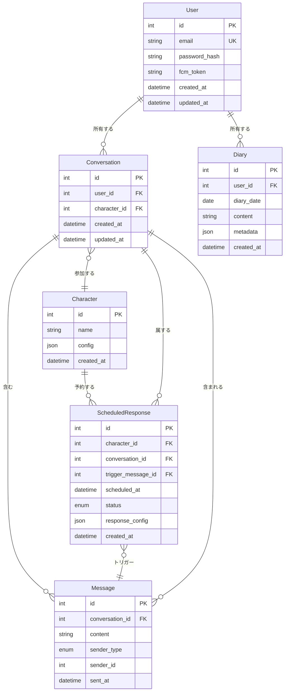
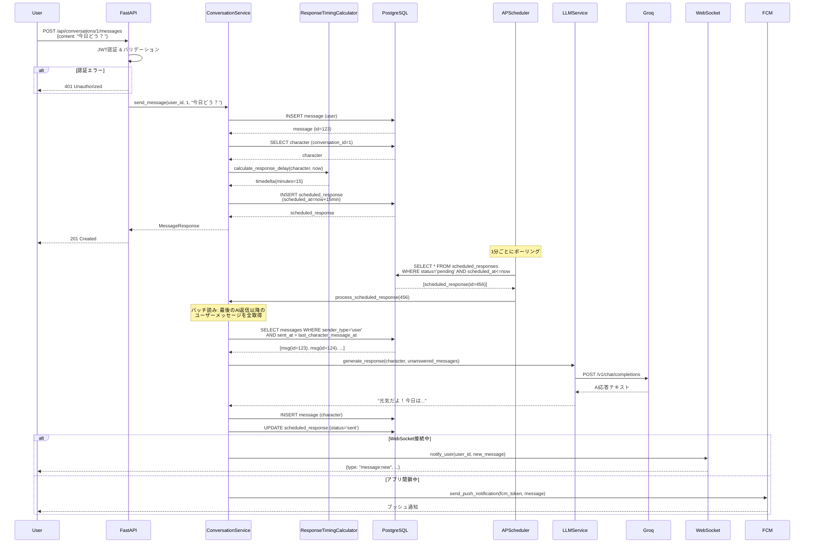
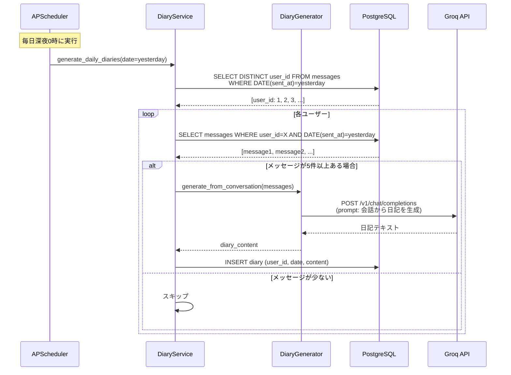

# 詳細設計書

## ディレクトリ構造

```
app/
├── __init__.py
├── main.py                      # FastAPIアプリケーションエントリーポイント
├── core/
│   ├── __init__.py
│   ├── config.py                # 環境変数・設定管理（pydantic-settings）
│   ├── security.py              # JWT認証・パスワードハッシュ化
│   └── database.py              # DB接続設定（AsyncSession）
├── models/                      # SQLAlchemyモデル（データレイヤー）
│   ├── __init__.py
│   ├── user.py
│   ├── character.py
│   ├── conversation.py
│   ├── message.py
│   ├── scheduled_response.py
│   └── diary.py
├── schemas/                     # Pydanticスキーマ（バリデーション）
│   ├── __init__.py
│   ├── user.py
│   ├── character.py
│   ├── message.py
│   └── diary.py
├── api/                         # APIレイヤー（Presentation）
│   ├── __init__.py
│   ├── deps.py                  # 依存性注入（DB session、認証ユーザー取得）
│   ├── routes/
│   │   ├── __init__.py
│   │   ├── auth.py              # 認証エンドポイント
│   │   ├── conversations.py     # 会話エンドポイント
│   │   ├── messages.py          # メッセージエンドポイント
│   │   ├── diaries.py           # 日記エンドポイント
│   │   └── characters.py        # キャラクターエンドポイント
│   └── websocket.py             # WebSocket接続管理
├── services/                    # サービスレイヤー（Application）
│   ├── __init__.py
│   ├── conversation_service.py  # 会話ロジック
│   ├── diary_service.py         # 日記生成ロジック
│   └── llm_service.py           # Groq API連携
├── domain/                      # ドメインレイヤー（Domain）
│   ├── __init__.py
│   ├── character.py             # キャラクタードメインモデル
│   ├── response_timing.py       # 返信タイミング計算
│   └── diary_generator.py       # 日記生成ロジック
├── repositories/                # リポジトリ（データアクセス）
│   ├── __init__.py
│   ├── user_repository.py
│   ├── conversation_repository.py
│   ├── message_repository.py
│   ├── scheduled_response_repository.py
│   └── diary_repository.py
└── scheduler/                   # スケジューラー（バックグラウンドジョブ）
    ├── __init__.py
    └── jobs.py                  # 定期実行ジョブ（返信処理、日記生成）

alembic/                         # マイグレーション
├── versions/
└── env.py

tests/
├── unit/
├── integration/
└── e2e/

frontend/                        # フロントエンド（React）
├── src/
│   ├── components/
│   ├── pages/
│   ├── hooks/
│   └── api/
└── package.json
```

## データモデル定義

### エンティティ: User（ユーザー）

**SQLAlchemyモデル**:

```python
# app/models/user.py
from sqlalchemy import Column, Integer, String, DateTime
from sqlalchemy.sql import func
from app.core.database import Base

class User(Base):
    __tablename__ = "users"

    id = Column(Integer, primary_key=True, index=True)
    email = Column(String(254), unique=True, nullable=False, index=True)  # RFC 5322準拠
    password_hash = Column(String(128), nullable=False)
    fcm_token = Column(String(255), nullable=True)  # FCMデバイストークン（プッシュ通知用）
    created_at = Column(DateTime(timezone=True), server_default=func.now())
    updated_at = Column(DateTime(timezone=True), onupdate=func.now())
```

**Pydanticスキーマ**:

```python
# app/schemas/user.py
from pydantic import BaseModel, EmailStr, Field
from datetime import datetime

class UserCreate(BaseModel):
    email: EmailStr
    password: str = Field(..., min_length=8, max_length=100)

class UserResponse(BaseModel):
    id: int
    email: str
    created_at: datetime

    class Config:
        from_attributes = True  # SQLAlchemyモデルから変換可能
```

**制約**:

- email: RFC 5322準拠、最大254文字、ユニーク
- password: 最低8文字、bcryptでハッシュ化（ソルトラウンド12）

---

### エンティティ: Character（AIキャラクター）

**SQLAlchemyモデル**:

```python
# app/models/character.py
from sqlalchemy import Column, Integer, String, DateTime, JSON
from sqlalchemy.sql import func
from app.core.database import Base

class Character(Base):
    __tablename__ = "characters"

    id = Column(Integer, primary_key=True, index=True)
    name = Column(String(100), nullable=False)
    config = Column(JSON, nullable=False)  # CharacterConfig（JSONB）
    created_at = Column(DateTime(timezone=True), server_default=func.now())
```

**CharacterConfig構造**（JSONBに保存）:

```python
# app/domain/character.py
from typing import Literal
from pydantic import BaseModel

class ResponsePattern(BaseModel):
    base_delay_minutes: dict[str, int]  # {"min": 5, "max": 30}
    time_of_day_modifiers: list[dict]  # [{"hours": [12, 13], "multiplier": 0.5}]
    randomness_factor: float = 0.2  # 0-1（ランダム性の度合い）
    reply_probability: float = 1.0  # 0-1（応答率、既読スルーの確率）

class CharacterConfig(BaseModel):
    personality: Literal['diligent', 'normal', 'busy']  # マメ、普通、忙しい
    occupation: Literal['office_worker', 'student', 'freelancer', 'homemaker']
    working_hours: dict[str, int] | None = None  # {"start": 9, "end": 18}
    response_patterns: ResponsePattern
    system_prompt: str  # LLMに渡すシステムプロンプト

class Character(BaseModel):
    id: int
    name: str
    config: CharacterConfig
```

**制約**:

- name: 1-100文字
- config: CharacterConfig形式のJSON、必須フィールドを含む

---

### エンティティ: Conversation（会話）

**SQLAlchemyモデル**:

```python
# app/models/conversation.py
from sqlalchemy import Column, Integer, ForeignKey, DateTime
from sqlalchemy.sql import func
from sqlalchemy.orm import relationship
from app.core.database import Base

class Conversation(Base):
    __tablename__ = "conversations"

    id = Column(Integer, primary_key=True, index=True)
    user_id = Column(Integer, ForeignKey("users.id", ondelete="CASCADE"), nullable=False, index=True)
    character_id = Column(Integer, ForeignKey("characters.id"), nullable=False)
    created_at = Column(DateTime(timezone=True), server_default=func.now())
    updated_at = Column(DateTime(timezone=True), onupdate=func.now())

    # リレーション
    user = relationship("User", backref="conversations")
    character = relationship("Character")
    messages = relationship("Message", back_populates="conversation", cascade="all, delete-orphan")
```

---

### エンティティ: Message（メッセージ）

**SQLAlchemyモデル**:

```python
# app/models/message.py
from sqlalchemy import Column, Integer, String, Text, ForeignKey, DateTime, Enum
from sqlalchemy.sql import func
from sqlalchemy.orm import relationship
from app.core.database import Base
import enum

class SenderType(str, enum.Enum):
    USER = "user"
    CHARACTER = "character"

class Message(Base):
    __tablename__ = "messages"

    id = Column(Integer, primary_key=True, index=True)
    conversation_id = Column(Integer, ForeignKey("conversations.id", ondelete="CASCADE"), nullable=False, index=True)
    content = Column(Text, nullable=False)  # メッセージ本文
    sender_type = Column(Enum(SenderType), nullable=False)
    sender_id = Column(Integer, nullable=False)  # user_id または character_id
    sent_at = Column(DateTime(timezone=True), server_default=func.now(), index=True)

    # リレーション
    conversation = relationship("Conversation", back_populates="messages")
```

**制約**:

- content: 最大1000文字
- sender_type: "user" | "character"
- sent_at: インデックス付き（時系列クエリの最適化）

---

### エンティティ: ScheduledResponse（予約返信）

**SQLAlchemyモデル**:

```python
# app/models/scheduled_response.py
from sqlalchemy import Column, Integer, String, ForeignKey, DateTime, JSON, Enum
from sqlalchemy.sql import func
from app.core.database import Base
import enum

class ResponseStatus(str, enum.Enum):
    PENDING = "pending"
    SENT = "sent"
    CANCELLED = "cancelled"

class ScheduledResponse(Base):
    __tablename__ = "scheduled_responses"

    id = Column(Integer, primary_key=True, index=True)
    character_id = Column(Integer, ForeignKey("characters.id"), nullable=False)
    conversation_id = Column(Integer, ForeignKey("conversations.id", ondelete="CASCADE"), nullable=False)
    trigger_message_id = Column(Integer, ForeignKey("messages.id"), nullable=False)
    scheduled_at = Column(DateTime(timezone=True), nullable=False, index=True)  # 返信予定時刻
    status = Column(Enum(ResponseStatus), default=ResponseStatus.PENDING, nullable=False, index=True)
    response_config = Column(JSON)  # 応答生成パラメータ（会話履歴のID範囲など）
    created_at = Column(DateTime(timezone=True), server_default=func.now())
```

**制約**:

- scheduled_at: インデックス付き（cronジョブのポーリング最適化）
- status: インデックス付き（status = 'pending' でのフィルタリング）

---

### エンティティ: Diary（日記）

**SQLAlchemyモデル**:

```python
# app/models/diary.py
from sqlalchemy import Column, Integer, Date, Text, ForeignKey, DateTime, JSON, UniqueConstraint
from sqlalchemy.sql import func
from app.core.database import Base

class Diary(Base):
    __tablename__ = "diaries"
    __table_args__ = (
        UniqueConstraint('user_id', 'diary_date', name='uq_user_diary_date'),
    )

    id = Column(Integer, primary_key=True, index=True)
    user_id = Column(Integer, ForeignKey("users.id", ondelete="CASCADE"), nullable=False, index=True)
    diary_date = Column(Date, nullable=False, index=True)
    content = Column(Text, nullable=False)
    metadata = Column(JSON)  # {"conversation_ids": [1, 2], "message_count": 10}
    created_at = Column(DateTime(timezone=True), server_default=func.now())
```

**制約**:

- (user_id, diary_date): 複合ユニーク制約（1ユーザー1日1件のみ）
- diary_date: インデックス付き（日付範囲検索の最適化）

---

### ER図



## コンポーネント設計

### ConversationService（サービスレイヤー）

**責務**:

- ユーザーメッセージの送信処理
- AI応答のスケジュール作成
- スケジュール済み返信の処理（バッチ読み込み）
- 会話履歴の取得

**インターフェース**:

```python
# app/services/conversation_service.py
from datetime import datetime
from fastapi import BackgroundTasks
from app.schemas.message import MessageCreate, MessageResponse
from app.models.message import Message
from app.repositories.message_repository import MessageRepository
from app.repositories.scheduled_response_repository import ScheduledResponseRepository
from app.domain.response_timing import ResponseTimingCalculator
from app.domain.character import Character

class ConversationService:
    def __init__(
        self,
        message_repo: MessageRepository,
        scheduled_response_repo: ScheduledResponseRepository,
        timing_calculator: ResponseTimingCalculator
    ):
        self.message_repo = message_repo
        self.scheduled_response_repo = scheduled_response_repo
        self.timing_calculator = timing_calculator

    async def send_message(
        self,
        user_id: int,
        conversation_id: int,
        content: str,
        background_tasks: BackgroundTasks
    ) -> MessageResponse:
        """
        ユーザーメッセージを送信し、AI応答をスケジュール

        1. ユーザーメッセージをDBに保存
        2. 返信タイミングを計算
        3. ScheduledResponseを作成
        4. バックグラウンドタスクでWebSocket通知（オプション）
        """
        # メッセージ保存
        message = await self.message_repo.create(
            conversation_id=conversation_id,
            content=content,
            sender_type="user",
            sender_id=user_id
        )

        # 返信タイミング計算
        character = await self._get_character(conversation_id)
        delay = self.timing_calculator.calculate_response_delay(
            character=character,
            current_time=datetime.now(),
            conversation_context={}
        )
        scheduled_at = datetime.now() + delay

        # スケジュール作成
        await self.scheduled_response_repo.create(
            character_id=character.id,
            conversation_id=conversation_id,
            trigger_message_id=message.id,
            scheduled_at=scheduled_at
        )

        return MessageResponse.from_orm(message)

    async def process_scheduled_response(
        self,
        scheduled_response_id: int
    ) -> None:
        """
        スケジュール済み返信を処理する（バッチ読み込み）

        1. 最後のAI返信以降のユーザーメッセージを全取得
        2. まとめてLLMに渡して1つの返信を生成
        3. メッセージとして保存しWebSocket通知
        """
        scheduled = await self.scheduled_response_repo.get(scheduled_response_id)

        # 最後のAI返信以降のユーザーメッセージを全取得（バッチ読み）
        unread_messages = await self.message_repo.get_unanswered_user_messages(
            conversation_id=scheduled.conversation_id
        )

        # 会話履歴（コンテキスト）と未読メッセージをまとめてLLMに渡す
        character = await self._get_character(scheduled.conversation_id)
        response_text = await self.llm_service.generate_response(
            character=character,
            messages=unread_messages
        )

        # AI返信をDBに保存
        await self.message_repo.create(
            conversation_id=scheduled.conversation_id,
            content=response_text,
            sender_type="character",
            sender_id=character.id
        )

        await self.scheduled_response_repo.mark_as_sent(scheduled_response_id)

    async def get_messages(
        self,
        conversation_id: int,
        limit: int = 50
    ) -> list[MessageResponse]:
        """会話のメッセージ一覧を取得（最新50件）"""
        messages = await self.message_repo.get_recent(conversation_id, limit)
        return [MessageResponse.from_orm(m) for m in messages]
```

**依存関係**:

- MessageRepository（データアクセス）
  - `get_unanswered_user_messages(conversation_id)`: 最後のAI返信以降のユーザーメッセージを取得
- ScheduledResponseRepository（データアクセス）
- ResponseTimingCalculator（ドメインサービス）
- LLMService（Groq API連携）

---

### ResponseTimingCalculator（ドメインサービス）

**責務**:

- キャラクターの性格・職業・時間帯を考慮して返信タイミングを計算

**アルゴリズム**:

```python
# app/domain/response_timing.py
from datetime import datetime, timedelta
import random
from app.domain.character import Character, CharacterConfig

class ResponseTimingCalculator:
    """返信タイミング計算ドメインサービス"""

    def calculate_response_delay(
        self,
        character: Character,
        current_time: datetime,
        conversation_context: dict
    ) -> timedelta:
        """
        返信遅延時間を計算

        計算ロジック:
        1. 基本遅延時間を性格から取得（min-maxの範囲）
        2. 時間帯による補正（勤務時間中は遅延が長くなる）
        3. ランダム性を追加（自然な揺らぎ）
        4. 既読スルーの判定

        Returns:
            timedelta: 返信までの遅延時間
        """
        config = character.config
        pattern = config.response_patterns

        # 1. 基本遅延時間（分）
        base_min = pattern.base_delay_minutes["min"]
        base_max = pattern.base_delay_minutes["max"]
        base_delay = random.uniform(base_min, base_max)

        # 2. 時間帯による補正
        current_hour = current_time.hour
        time_multiplier = self._get_time_multiplier(current_hour, pattern.time_of_day_modifiers)
        adjusted_delay = base_delay * time_multiplier

        # 3. 勤務時間中の補正（職業による）
        if config.working_hours:
            start_hour = config.working_hours["start"]
            end_hour = config.working_hours["end"]
            if start_hour <= current_hour < end_hour:
                # 勤務時間中は返信が遅くなる
                adjusted_delay *= 2.0

        # 4. ランダム性の追加
        randomness = pattern.randomness_factor
        noise = random.uniform(-randomness, randomness)
        final_delay = adjusted_delay * (1 + noise)

        # 5. 既読スルーの判定
        if random.random() > pattern.reply_probability:
            # 既読スルー: 大幅に遅延を追加（数時間後）
            final_delay += random.uniform(120, 360)  # 2-6時間

        return timedelta(minutes=max(1, final_delay))  # 最低1分

    def _get_time_multiplier(self, hour: int, modifiers: list[dict]) -> float:
        """時間帯による補正倍率を取得"""
        for modifier in modifiers:
            if hour in modifier["hours"]:
                return modifier["multiplier"]
        return 1.0  # デフォルト（補正なし）
```

**実装例**:

キャラクター設定例（マメな会社員）:

```json
{
  "personality": "diligent",
  "occupation": "office_worker",
  "working_hours": { "start": 9, "end": 18 },
  "response_patterns": {
    "base_delay_minutes": { "min": 3, "max": 10 },
    "time_of_day_modifiers": [
      { "hours": [12, 13], "multiplier": 0.5 },
      { "hours": [19, 20, 21], "multiplier": 0.7 }
    ],
    "randomness_factor": 0.2,
    "reply_probability": 0.95
  },
  "system_prompt": "あなたは親切で几帳面な会社員の友人です。"
}
```

→ 平日14時にメッセージを受信した場合:

- 基本遅延: 3-10分
- 勤務時間中: ×2.0 → 6-20分
- ランダム性: ±20%
- **最終的な遅延: 約5-24分**

---

### DiaryGenerator（ドメインサービス）

**責務**:

- 1日の会話履歴からLLMを使って日記テキストを生成

**処理フロー**:

```python
# app/domain/diary_generator.py
from app.models.message import Message
from app.services.llm_service import LLMService

class DiaryGenerator:
    """日記生成ドメインサービス"""

    def __init__(self, llm_service: LLMService):
        self.llm_service = llm_service

    async def generate_from_conversation(
        self,
        messages: list[Message]
    ) -> str:
        """
        会話履歴から日記テキストを生成

        処理ステップ:
        1. 会話履歴を時系列で整形
        2. プロンプトを構築
        3. Groq APIで要約生成
        4. 生成されたテキストを返却
        """
        # 1. 会話履歴の整形
        conversation_text = self._format_messages(messages)

        # 2. プロンプト構築
        prompt = f"""以下は今日の会話履歴です。この会話から、日記形式で今日の出来事や気持ちを200-300文字程度で要約してください。

会話履歴:
{conversation_text}

日記:"""

        # 3. LLM呼び出し
        diary_content = await self.llm_service.generate_text(
            prompt=prompt,
            max_tokens=400
        )

        return diary_content.strip()

    def _format_messages(self, messages: list[Message]) -> str:
        """メッセージを会話形式に整形"""
        lines = []
        for msg in messages:
            sender = "自分" if msg.sender_type == "user" else "AI"
            lines.append(f"{sender}: {msg.content}")
        return "\n".join(lines)
```

---

## ユースケース詳細

### ユースケース: メッセージ送信 → AI応答スケジュール



**フロー説明**:

1. ユーザーがメッセージを送信
2. API層で認証・バリデーション
3. ConversationServiceがメッセージをDB保存
4. ResponseTimingCalculatorで返信タイミングを計算（性格・時間帯考慮）
5. ScheduledResponseをDBに保存（scheduled_at = 現在時刻 + 遅延時間）
6. 即座にレスポンスを返却（201 Created）
7. APSchedulerが1分ごとにポーリング
8. scheduled_atを過ぎたレコードを取得
9. **バッチ読み**: 最後のAI返信以降のユーザーメッセージを全取得（複数メッセージをまとめて処理）
10. 未読メッセージをまとめてGroq APIに渡しAI応答を生成
11. メッセージとして保存し、WebSocketで通知

---

### ユースケース: 日記自動生成（バッチ処理）



---

## API設計

### POST /api/auth/register（ユーザー登録）

**リクエスト**:

```json
{
  "email": "user@example.com",
  "password": "securepass123"
}
```

**レスポンス** (201 Created):

```json
{
  "id": 1,
  "email": "user@example.com",
  "created_at": "2026-04-12T10:00:00Z"
}
```

**エラーレスポンス**:

- 400 Bad Request: メール形式が不正 / パスワードが8文字未満
- 409 Conflict: メールアドレスが既に登録済み

---

### POST /api/auth/login（ログイン）

**リクエスト**:

```json
{
  "email": "user@example.com",
  "password": "securepass123"
}
```

**レスポンス** (200 OK):

```json
{
  "access_token": "eyJhbGciOiJIUzI1NiIsInR5cCI6IkpXVCJ9...",
  "token_type": "bearer"
}
```

**エラーレスポンス**:

- 401 Unauthorized: メールアドレスまたはパスワードが不正

---

### POST /api/conversations/{conversation_id}/messages（メッセージ送信）

**リクエスト**:

```json
{
  "content": "今日の天気どう？"
}
```

**レスポンス** (201 Created):

```json
{
  "id": 123,
  "conversation_id": 1,
  "content": "今日の天気どう？",
  "sender_type": "user",
  "sender_id": 5,
  "sent_at": "2026-04-12T14:30:00Z"
}
```

**エラーレスポンス**:

- 400 Bad Request: contentが空 / 1000文字超過
- 401 Unauthorized: 認証トークンが不正
- 403 Forbidden: 他のユーザーの会話にアクセス
- 404 Not Found: 会話が存在しない

---

### GET /api/conversations/{conversation_id}/messages（メッセージ一覧取得）

**クエリパラメータ**:

- `limit`: 取得件数（デフォルト: 50）

**レスポンス** (200 OK):

```json
{
  "messages": [
    {
      "id": 124,
      "content": "元気だよ！",
      "sender_type": "character",
      "sender_id": 2,
      "sent_at": "2026-04-12T14:45:00Z"
    },
    {
      "id": 123,
      "content": "今日の天気どう？",
      "sender_type": "user",
      "sender_id": 5,
      "sent_at": "2026-04-12T14:30:00Z"
    }
  ]
}
```

---

### PUT /api/auth/fcm-token（FCMトークン登録・更新）

**リクエスト**:

```json
{
  "fcm_token": "eH3k9..."
}
```

**レスポンス** (200 OK):

```json
{
  "message": "FCMトークンを更新しました"
}
```

**エラーレスポンス**:

- 401 Unauthorized: 認証トークンが不正

---

### GET /api/diaries（日記一覧取得）

**クエリパラメータ**:

- `limit`: 取得件数（デフォルト: 30）

**レスポンス** (200 OK):

```json
{
  "diaries": [
    {
      "id": 10,
      "diary_date": "2026-04-11",
      "content": "今日はAIと天気の話をした。晴れていて気持ちよかった。",
      "created_at": "2026-04-12T00:05:00Z"
    }
  ]
}
```

---

### GET /api/diaries/{date}（特定日付の日記取得）

**パスパラメータ**:

- `date`: 日付（YYYY-MM-DD形式）

**レスポンス** (200 OK):

```json
{
  "id": 10,
  "diary_date": "2026-04-11",
  "content": "今日はAIと天気の話をした。晴れていて気持ちよかった。",
  "metadata": {
    "conversation_ids": [1],
    "message_count": 12
  },
  "created_at": "2026-04-12T00:05:00Z"
}
```

**エラーレスポンス**:

- 404 Not Found: 指定日付の日記が存在しない

---

## エラーハンドリング

### エラーの分類

| エラー種別           | HTTPステータス | 処理                            | ユーザーへの表示                   |
| -------------------- | -------------- | ------------------------------- | ---------------------------------- |
| バリデーションエラー | 400            | リクエストを拒否                | "入力内容を確認してください"       |
| 認証エラー           | 401            | リクエストを拒否                | "ログインしてください"             |
| 権限エラー           | 403            | リクエストを拒否                | "この操作は許可されていません"     |
| リソース未検出       | 404            | リクエストを拒否                | "指定されたデータが見つかりません" |
| Groq APIタイムアウト | 500            | 最大3回リトライ、失敗時はエラー | "一時的にサービスが利用できません" |
| DB接続エラー         | 500            | ログ記録、エラーレスポンス      | "システムエラーが発生しました"     |
| 予期しないエラー     | 500            | ログ記録、スタックトレース保存  | "予期しないエラーが発生しました"   |

**実装例**:

```python
# app/api/routes/messages.py
from fastapi import HTTPException, status

@router.post("/conversations/{conversation_id}/messages")
async def create_message(
    conversation_id: int,
    message: MessageCreate,
    current_user: User = Depends(get_current_user)
):
    try:
        # 会話の所有権確認
        conversation = await conversation_repo.get(conversation_id)
        if not conversation:
            raise HTTPException(
                status_code=status.HTTP_404_NOT_FOUND,
                detail="会話が見つかりません"
            )
        if conversation.user_id != current_user.id:
            raise HTTPException(
                status_code=status.HTTP_403_FORBIDDEN,
                detail="この会話にアクセスする権限がありません"
            )

        # メッセージ送信
        result = await conversation_service.send_message(
            user_id=current_user.id,
            conversation_id=conversation_id,
            content=message.content,
            background_tasks=background_tasks
        )
        return result

    except HTTPException:
        raise
    except Exception as e:
        logger.error(f"Unexpected error: {e}", exc_info=True)
        raise HTTPException(
            status_code=status.HTTP_500_INTERNAL_SERVER_ERROR,
            detail="予期しないエラーが発生しました"
        )
```

---

## データベースインデックス戦略

### パフォーマンス最適化のためのインデックス

```sql
-- messages テーブル
CREATE INDEX idx_messages_conversation_id ON messages(conversation_id);
CREATE INDEX idx_messages_sent_at ON messages(sent_at DESC);
CREATE INDEX idx_messages_conversation_sent ON messages(conversation_id, sent_at DESC);

-- scheduled_responses テーブル
CREATE INDEX idx_scheduled_responses_scheduled_at ON scheduled_responses(scheduled_at);
CREATE INDEX idx_scheduled_responses_status ON scheduled_responses(status);
CREATE INDEX idx_scheduled_responses_pending ON scheduled_responses(status, scheduled_at) WHERE status = 'pending';

-- diaries テーブル
CREATE INDEX idx_diaries_user_id ON diaries(user_id);
CREATE INDEX idx_diaries_diary_date ON diaries(diary_date DESC);
CREATE INDEX idx_diaries_user_date ON diaries(user_id, diary_date DESC);

-- conversations テーブル
CREATE INDEX idx_conversations_user_id ON conversations(user_id);
```

**理由**:

- `idx_messages_conversation_sent`: 会話履歴取得クエリの最適化（会話ID + 時系列ソート）
- `idx_scheduled_responses_pending`: APSchedulerのポーリングクエリの最適化（部分インデックス）
- `idx_diaries_user_date`: ユーザーの日記一覧取得の最適化
